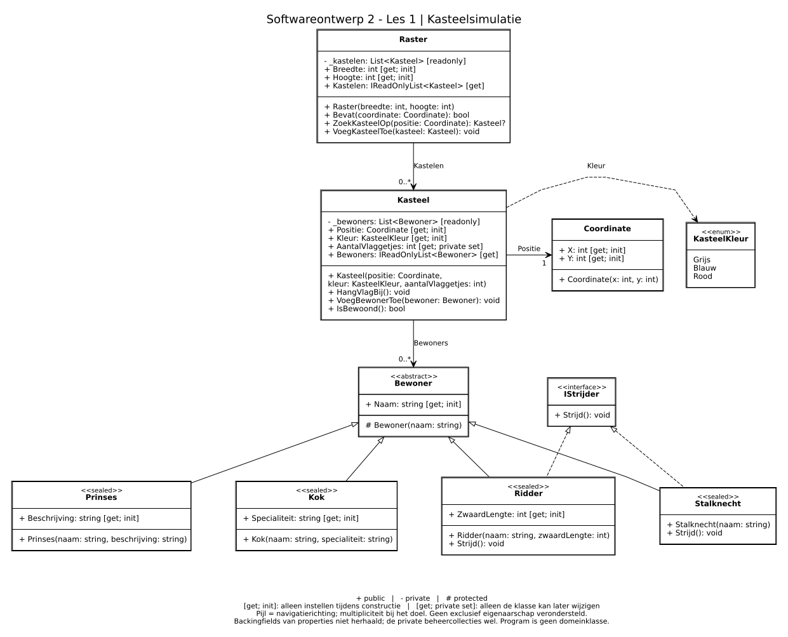

# Kasteelsimulatie — uitgewerkte basisoplossing

Alle Must- en Should-punten van de oefening zijn in het project uitgewerkt. De commentaren staan ook rechtstreeks in de afzonderlijke .cs-bestanden. Zie README.md in de hoofdmap voor de ontwerpkeuzes, validatieregels en startinstructies.

De optionele Could-uitbreiding staat los in de map Could.

## Bestanden

```text
Kasteelsimulatie.sln
Kasteelsimulatie/
  Kasteelsimulatie.csproj
  Program.cs
  Domein/
    Coordinate.cs
    KasteelKleur.cs
    Raster.cs
    Kasteel.cs
    Bewoner.cs
    Prinses.cs
    Kok.cs
    IStrijder.cs
    Ridder.cs
    Stalknecht.cs
```

## DCD



## Projectinstellingen

```xml
<Project Sdk="Microsoft.NET.Sdk">
  <PropertyGroup>
    <OutputType>Exe</OutputType>
    <TargetFramework>net10.0</TargetFramework>
    <ImplicitUsings>enable</ImplicitUsings>
    <Nullable>enable</Nullable>
  </PropertyGroup>
</Project>
```

## Domein/Coordinate.cs

```csharp
namespace Kasteelsimulatie.Domein;

// Een Coordinate bundelt twee waarden die samen één positie voorstellen.
// Deze klasse hoeft niet te weten of er een raster bestaat of hoe groot dat is.
public class Coordinate
{
    // Na de constructie ligt de positie vast. Een publieke set zou toelaten
    // om een geplaatst kasteel achteraf buiten het raster te verplaatsen.
    public int X { get; init; }
    public int Y { get; init; }

    public Coordinate(int x, int y)
    {
        X = x;
        Y = y;
    }

    // Negatieve coördinaten zijn op zichzelf toegestaan.
    // Of een positie in een bepaald raster ligt, wordt door Raster gecontroleerd.
}
```

## Domein/KasteelKleur.cs

```csharp
namespace Kasteelsimulatie.Domein;

// Met een enum benoemen we de toegelaten kleuren.
// Zo verspreiden we geen losse teksten zoals "blauw" en "Blauw" door de code.
public enum KasteelKleur
{
    Grijs,
    Blauw,
    Rood
}
```

## Domein/Raster.cs

```csharp
namespace Kasteelsimulatie.Domein;

public class Raster
{
    // readonly verhindert dat we de lijst door een andere lijst vervangen.
    // Het verhindert NIET dat Raster zelf nog elementen toevoegt.
    private readonly List<Kasteel> _kastelen = new();

    private int _breedte;
    private int _hoogte;

    public int Breedte
    {
        get => _breedte;
        init
        {
            // value is de waarde die aan deze property wordt toegewezen.
            // De controle staat in init: ook een object initializer moet
            // de regel respecteren, niet alleen de constructor.
            if (value <= 0)
            {
                throw new ArgumentOutOfRangeException(
                    nameof(value), "De breedte moet groter zijn dan nul.");
            }

            _breedte = value;
        }
    }

    public int Hoogte
    {
        get => _hoogte;
        init
        {
            if (value <= 0)
            {
                throw new ArgumentOutOfRangeException(
                    nameof(value), "De hoogte moet groter zijn dan nul.");
            }

            _hoogte = value;
        }
    }

    // AsReadOnly geeft een beschermde toegang tot dezelfde lijst.
    // Aanroepende code kan de kastelen bekijken, maar niet Add of Clear gebruiken.
    // De kastelen zelf blijven objecten waarop gedrag kan worden uitgevoerd.
    public IReadOnlyList<Kasteel> Kastelen => _kastelen.AsReadOnly();

    public Raster(int breedte, int hoogte)
    {
        // De toekenningen voeren ook de controles in de init-accessors uit.
        Breedte = breedte;
        Hoogte = hoogte;
    }

    public bool Bevat(Coordinate coordinate)
    {
        ArgumentNullException.ThrowIfNull(coordinate);

        // We tellen vanaf nul. Bij breedte 5 zijn X-waarden 0 tot en met 4 geldig.
        // Deze methode beantwoordt "ligt dit binnen de grenzen?",
        // niet "staat hier al een kasteel?".
        return coordinate.X >= 0
            && coordinate.Y >= 0
            && coordinate.X < Breedte
            && coordinate.Y < Hoogte;
    }

    public Kasteel? ZoekKasteelOp(Coordinate positie)
    {
        ArgumentNullException.ThrowIfNull(positie);

        foreach (var kasteel in _kastelen)
        {
            // Twee verschillende Coordinate-objecten kunnen dezelfde positie
            // voorstellen. In deze basisversie vergelijken we daarom X en Y,
            // niet de objectreferenties met kasteel.Positie == positie.
            if (kasteel.Positie.X == positie.X
                && kasteel.Positie.Y == positie.Y)
            {
                return kasteel;
            }
        }

        // Het vraagteken in Kasteel? maakt duidelijk dat er geen resultaat
        // kan zijn. We maken geen fictief kasteel om dat geval op te vullen.
        return null;
    }

    public void VoegKasteelToe(Kasteel kasteel)
    {
        ArgumentNullException.ThrowIfNull(kasteel);

        // Raster kent zowel zijn grenzen als de al aanwezige kastelen.
        // Het bewaakt deze regels dus zelf, ook wanneer andere code het gebruikt.
        if (!Bevat(kasteel.Positie))
        {
            throw new ArgumentException(
                "Een kasteel moet binnen de grenzen van het raster liggen.",
                nameof(kasteel));
        }

        // We hergebruiken de zoekmethode. Zo staat de vergelijking van
        // posities niet op twee verschillende plaatsen in deze klasse.
        if (ZoekKasteelOp(kasteel.Positie) is not null)
        {
            throw new InvalidOperationException(
                "Deze positie is al ingenomen door een kasteel.");
        }

        // Pas nadat alle controles geslaagd zijn, wijzigen we de lijst.
        // Een geweigerde toevoeging laat het raster dus ongewijzigd.
        _kastelen.Add(kasteel);
    }
}
```

## Domein/Kasteel.cs

```csharp
namespace Kasteelsimulatie.Domein;

public class Kasteel
{
    private readonly List<Bewoner> _bewoners = new();
    private Coordinate _positie;
    private KasteelKleur _kleur;

    public Coordinate Positie
    {
        get => _positie;
        init
        {
            // Een kasteel kan niet zonder positie bestaan.
            // Ook een object initializer mag hier geen null invullen.
            ArgumentNullException.ThrowIfNull(value);
            _positie = value;
        }
    }

    public KasteelKleur Kleur
    {
        get => _kleur;
        init
        {
            // Een cast zoals (KasteelKleur)999 is syntactisch mogelijk,
            // maar stelt geen kleur uit onze enum voor.
            if (!Enum.IsDefined(typeof(KasteelKleur), value))
            {
                throw new ArgumentOutOfRangeException(
                    nameof(value), "Kies een kleur die in KasteelKleur bestaat.");
            }

            _kleur = value;
        }
    }

    // Het aantal mag na constructie veranderen, maar alleen via deze klasse.
    // Daarom gebruiken we private set en niet init of een publieke set.
    public int AantalVlaggetjes { get; private set; }

    // Eén collectie voor ALLE bewoners, dus geen aparte lijst per bewonertype.
    public IReadOnlyList<Bewoner> Bewoners => _bewoners.AsReadOnly();

    public Kasteel(
        Coordinate positie,
        KasteelKleur kleur,
        int aantalVlaggetjes)
    {
        ArgumentNullException.ThrowIfNull(positie);

        if (aantalVlaggetjes < 0)
        {
            throw new ArgumentOutOfRangeException(
                nameof(aantalVlaggetjes), "Het aantal vlaggetjes mag niet negatief zijn.");
        }

        // De positie is hierboven gecontroleerd. We initialiseren het veld
        // rechtstreeks, zodat het zeker een niet-null waarde krijgt.
        _positie = positie;
        Kleur = kleur;
        AantalVlaggetjes = aantalVlaggetjes;
    }

    public void HangVlagBij()
    {
        // Ook aan de bovengrens van int mag het aantal niet negatief worden.
        if (AantalVlaggetjes == int.MaxValue)
        {
            throw new InvalidOperationException(
                "Het maximaal voorstelbare aantal vlaggetjes is bereikt.");
        }

        AantalVlaggetjes++;
    }

    public void VoegBewonerToe(Bewoner bewoner)
    {
        ArgumentNullException.ThrowIfNull(bewoner);

        // Deze methode hoeft niet te weten of dit een ridder, kok, ... is.
        // Elk object dat een Bewoner is, past in de bewonerscollectie.
        _bewoners.Add(bewoner);
    }

    public bool IsBewoond()
    {
        // We leiden dit af uit de lijst in plaats van een extra bool bij te houden.
        // Anders zouden die bool en de lijst elkaar kunnen tegenspreken.
        return _bewoners.Count > 0;
    }
}
```

## Domein/Bewoner.cs

```csharp
namespace Kasteelsimulatie.Domein;

// abstract: "bewoner" is hier een gemeenschappelijk concept.
// We maken concrete bewoners, bijvoorbeeld een Kok, geen losse Bewoner.
public abstract class Bewoner
{
    private string _naam = string.Empty;

    public string Naam
    {
        get => _naam;
        init
        {
            // Ook null, een lege string en alleen spaties zijn geen geldige naam.
            if (string.IsNullOrWhiteSpace(value))
            {
                throw new ArgumentException(
                    "Een bewoner moet een niet-lege naam hebben.", nameof(value));
            }

            _naam = value;
        }
    }

    // protected: afgeleide klassen mogen deze constructor aanroepen met base(...).
    // Aanroepende code maakt een concreet bewonertype aan.
    protected Bewoner(string naam)
    {
        Naam = naam;
    }
}
```

## Domein/Prinses.cs

```csharp
namespace Kasteelsimulatie.Domein;

// Een Prinses IS EEN Bewoner. De naam en de naamvalidatie komen uit Bewoner.
// sealed: we voorzien in dit ontwerp geen verdere afgeleide prinsessentypes.
public sealed class Prinses : Bewoner
{
    private string _beschrijving = string.Empty;

    public string Beschrijving
    {
        get => _beschrijving;
        init
        {
            if (string.IsNullOrWhiteSpace(value))
            {
                throw new ArgumentException(
                    "Een prinses moet een niet-lege beschrijving hebben.", nameof(value));
            }

            _beschrijving = value;
        }
    }

    public Prinses(string naam, string beschrijving) : base(naam)
    {
        // base(naam) laat de basisklasse het gemeenschappelijke deel opbouwen.
        // Deze constructor zorgt alleen voor de bijkomende prinsessengegevens.
        Beschrijving = beschrijving;
    }
}
```

## Domein/Kok.cs

```csharp
namespace Kasteelsimulatie.Domein;

public sealed class Kok : Bewoner
{
    private string _specialiteit = string.Empty;

    public string Specialiteit
    {
        get => _specialiteit;
        init
        {
            if (string.IsNullOrWhiteSpace(value))
            {
                throw new ArgumentException(
                    "Een kok moet een niet-lege specialiteit hebben.", nameof(value));
            }

            _specialiteit = value;
        }
    }

    public Kok(string naam, string specialiteit) : base(naam)
    {
        Specialiteit = specialiteit;
    }

    // Kok implementeert IStrijder niet: niet iedere bewoner moet kunnen strijden.
}
```

## Domein/IStrijder.cs

```csharp
namespace Kasteelsimulatie.Domein;

// Het contract beschrijft WELK gedrag beschikbaar is, niet HOE het werkt.
// Een klasse hoeft geen Bewoner te zijn om dit contract te implementeren.
public interface IStrijder
{
    void Strijd();
}
```

## Domein/Ridder.cs

```csharp
namespace Kasteelsimulatie.Domein;

// Ridder is een Bewoner EN biedt het gedrag van een IStrijder aan.
public sealed class Ridder : Bewoner, IStrijder
{
    private int _zwaardLengte;

    // In deze uitwerking drukken we de zwaardlengte uit in centimeter.
    public int ZwaardLengte
    {
        get => _zwaardLengte;
        init
        {
            if (value <= 0)
            {
                throw new ArgumentOutOfRangeException(
                    nameof(value), "De zwaardlengte moet groter zijn dan nul.");
            }

            _zwaardLengte = value;
        }
    }

    public Ridder(string naam, int zwaardLengte) : base(naam)
    {
        ZwaardLengte = zwaardLengte;
    }

    public void Strijd()
    {
        // Zoals in de les maken we het gedrag zichtbaar met console-uitvoer.
        // We bouwen hier nog geen gevechtssysteem met schade of levenspunten.
        Console.WriteLine($"{Naam} vecht met een zwaard van {ZwaardLengte} cm.");
    }
}
```

## Domein/Stalknecht.cs

```csharp
namespace Kasteelsimulatie.Domein;

public sealed class Stalknecht : Bewoner, IStrijder
{
    public Stalknecht(string naam) : base(naam)
    {
        // Voorlopig heeft een stalknecht geen extra gegevens nodig.
        // Dat is geen reden om hier kunstmatige properties te verzinnen.
    }

    public void Strijd()
    {
        // Dezelfde methode uit hetzelfde contract, maar een andere uitvoering.
        Console.WriteLine($"{Naam} verdedigt het kasteel met een mestvork.");
    }
}
```

## Program.cs

```csharp
using Kasteelsimulatie.Domein;

// Dit is een vast testscenario, geen consolemenu en nog geen domeincontroller.
// Lees telkens de verwachte waarde en vergelijk die met de uitvoer.

Console.WriteLine("1. Raster en kastelen aanmaken");

var raster = new Raster(breedte: 5, hoogte: 4);

var blauwKasteel = new Kasteel(
    positie: new Coordinate(x: 1, y: 1),
    kleur: KasteelKleur.Blauw,
    aantalVlaggetjes: 2);

// (4, 3) is de laatste geldige positie van een raster van 5 bij 4.
var roodKasteel = new Kasteel(
    positie: new Coordinate(x: 4, y: 3),
    kleur: KasteelKleur.Rood,
    aantalVlaggetjes: 0);

raster.VoegKasteelToe(blauwKasteel);
raster.VoegKasteelToe(roodKasteel);

Console.WriteLine($"Aantal kastelen: {raster.Kastelen.Count} (verwacht: 2)");
Console.WriteLine($"Rood kasteel bewoond: {roodKasteel.IsBewoond()} (verwacht: False)");

Console.WriteLine();
Console.WriteLine("2. Verschillende bewoners toevoegen");

blauwKasteel.VoegBewonerToe(new Prinses(
    naam: "Emma", beschrijving: "Zorgt voor de contacten met naburige kastelen."));

// De variabele heeft het type Bewoner, het concrete object is een Ridder.
// Een ridder kan dus gebruikt worden waar een bewoner verwacht wordt.
Bewoner ridder = new Ridder(naam: "Arthur", zwaardLengte: 90);
blauwKasteel.VoegBewonerToe(ridder);

blauwKasteel.VoegBewonerToe(new Kok(naam: "Nora", specialiteit: "Groentesoep"));
blauwKasteel.VoegBewonerToe(new Stalknecht(naam: "Sam"));

roodKasteel.VoegBewonerToe(new Ridder(naam: "Lotte", zwaardLengte: 80));
roodKasteel.VoegBewonerToe(new Kok(naam: "Bas", specialiteit: "Vers brood"));

foreach (var kasteel in raster.Kastelen)
{
    Console.WriteLine(
        $"{kasteel.Kleur} kasteel op ({kasteel.Positie.X}, {kasteel.Positie.Y}):");

    // We gebruiken alleen gemeenschappelijke bewonersinformatie.
    foreach (var bewoner in kasteel.Bewoners)
    {
        Console.WriteLine($"  - {bewoner.Naam}");
    }
}

Console.WriteLine($"Blauwe bewoners: {blauwKasteel.Bewoners.Count} (verwacht: 4)");
Console.WriteLine($"Rode bewoners: {roodKasteel.Bewoners.Count} (verwacht: 2)");
Console.WriteLine($"Rood kasteel bewoond: {roodKasteel.IsBewoond()} (verwacht: True)");

Console.WriteLine();
Console.WriteLine("3. Toestand wijzigen via gedrag");

blauwKasteel.HangVlagBij();
Console.WriteLine($"Blauwe vlaggetjes: {blauwKasteel.AantalVlaggetjes} (verwacht: 3)");

// Deze voorbeelden blijven commentaar: ze horen NIET te compileren.
// blauwKasteel.AantalVlaggetjes = -5;               // Setter is private.
// blauwKasteel.Positie = new Coordinate(100, 100);  // init: constructie is voorbij.
// blauwKasteel.Positie.X = 100;                    // Ook Coordinate gebruikt init.
// raster.Kastelen.Clear();                        // Geen wijzigbare lijst beschikbaar.
// blauwKasteel.Bewoners.Add(new Stalknecht("Pim")); // Gebruik VoegBewonerToe().

Console.WriteLine();
Console.WriteLine("4. Alleen de strijders van het blauwe kasteel laten strijden");

// OfType<IStrijder>() selecteert bewoners die het contract aanbieden.
// We controleren nergens op concrete types zoals Ridder of Stalknecht.
// De aanroep is dezelfde; het concrete object bepaalt de uitvoering.
foreach (var strijder in blauwKasteel.Bewoners.OfType<IStrijder>())
{
    strijder.Strijd();
}

// Verwacht: Arthur en Sam strijden. Emma en Nora niet.
// Lotte strijdt evenmin: zij woont in het rode kasteel, niet in het blauwe.

Console.WriteLine();
Console.WriteLine("5. Zoeken met een nieuw Coordinate-object");

// Dit is niet hetzelfde Coordinate-object als bij de constructie van het kasteel.
// Toch moet de zoekmethode het kasteel op deze X- en Y-waarde terugvinden.
var gevondenKasteel = raster.ZoekKasteelOp(new Coordinate(x: 1, y: 1));

if (gevondenKasteel is not null)
{
    Console.WriteLine($"Gevonden kleur: {gevondenKasteel.Kleur} (verwacht: Blauw)");
}
else
{
    Console.WriteLine("ONVERWACHT: het blauwe kasteel is niet gevonden.");
}

var leegVak = raster.ZoekKasteelOp(new Coordinate(x: 0, y: 0));
Console.WriteLine($"Leeg vak geeft null: {leegVak is null} (verwacht: True)");

Console.WriteLine();
Console.WriteLine("6. De grenzen van het raster controleren");

Console.WriteLine($"(0, 0) binnen raster: {raster.Bevat(new Coordinate(0, 0))} (verwacht: True)");
Console.WriteLine($"(4, 3) binnen raster: {raster.Bevat(new Coordinate(4, 3))} (verwacht: True)");
Console.WriteLine($"(5, 0) binnen raster: {raster.Bevat(new Coordinate(5, 0))} (verwacht: False)");
Console.WriteLine($"(0, 4) binnen raster: {raster.Bevat(new Coordinate(0, 4))} (verwacht: False)");
Console.WriteLine($"(-1, 0) binnen raster: {raster.Bevat(new Coordinate(-1, 0))} (verwacht: False)");
Console.WriteLine($"(0, -1) binnen raster: {raster.Bevat(new Coordinate(0, -1))} (verwacht: False)");

Console.WriteLine();
Console.WriteLine("7. Ongeldige toevoegingen weigeren");

try
{
    // Alleen Raster kan bepalen dat deze positie buiten zijn grenzen ligt.
    var kasteelBuitenRaster = new Kasteel(
        new Coordinate(x: 5, y: 0), KasteelKleur.Grijs, aantalVlaggetjes: 0);

    raster.VoegKasteelToe(kasteelBuitenRaster);
    Console.WriteLine("ONVERWACHT: een kasteel buiten het raster werd aanvaard.");
}
catch (ArgumentException fout)
{
    // De regel staat in Raster. Dit scenario vangt de fout alleen op
    // zodat we daarna ook de andere gevallen nog kunnen bekijken.
    Console.WriteLine($"Verwacht geweigerd (buiten raster): {fout.Message}");
}

try
{
    var kasteelOpBezetVak = new Kasteel(
        new Coordinate(x: 1, y: 1), KasteelKleur.Grijs, aantalVlaggetjes: 1);

    raster.VoegKasteelToe(kasteelOpBezetVak);
    Console.WriteLine("ONVERWACHT: twee kastelen op dezelfde positie werden aanvaard.");
}
catch (InvalidOperationException fout)
{
    Console.WriteLine($"Verwacht geweigerd (bezet vak): {fout.Message}");
}

Console.WriteLine($"Aantal kastelen na beide weigeringen: {raster.Kastelen.Count} (verwacht: 2)");

Console.WriteLine();
Console.WriteLine("8. Verplichte waarden valideren");

try
{
    var ongeldigRaster = new Raster(breedte: 0, hoogte: 4);
    Console.WriteLine("ONVERWACHT: een raster met breedte nul werd aanvaard.");
}
catch (ArgumentOutOfRangeException fout)
{
    Console.WriteLine($"Verwacht geweigerd (breedte): {fout.Message}");
}

try
{
    var naamlozeKok = new Kok(naam: "   ", specialiteit: "Soep");
    Console.WriteLine("ONVERWACHT: een bewoner zonder naam werd aanvaard.");
}
catch (ArgumentException fout)
{
    Console.WriteLine($"Verwacht geweigerd (naam): {fout.Message}");
}

try
{
    // Met publieke init-accessors kan een object initializer de waarden van
    // de constructor tijdens de creatie nog overschrijven. Ook dat valideren we.
    var ongeldigRaster = new Raster(breedte: 5, hoogte: 4) { Breedte = 0 };
    Console.WriteLine("ONVERWACHT: de object initializer omzeilde de validatie.");
}
catch (ArgumentOutOfRangeException fout)
{
    Console.WriteLine($"Verwacht geweigerd (object initializer): {fout.Message}");
}

Console.WriteLine();
Console.WriteLine("Einde van het testscenario.");
```

## Controle

Deze code is inhoudelijk en structureel nagekeken, maar in de samenstellingsomgeving niet gecompileerd of uitgevoerd: daar was geen .NET SDK beschikbaar. Voer het project lokaal uit en vergelijk met Controlelijst.md.

## Bronnen

[De les en de oorspronkelijke oefening](https://hogent-so2.github.io/so2/01-klassen-objecten.html). Aanvullende Microsoft-documentatie is opgenomen in README.md.
